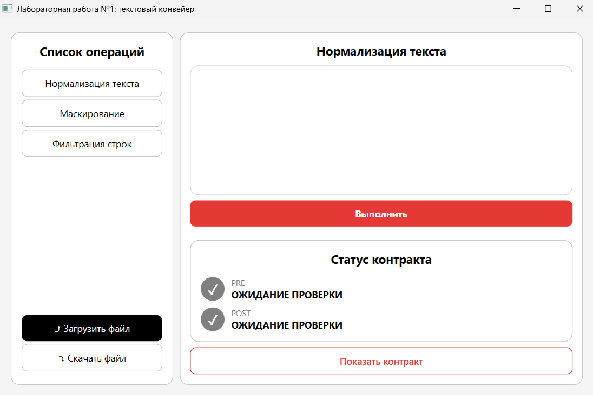
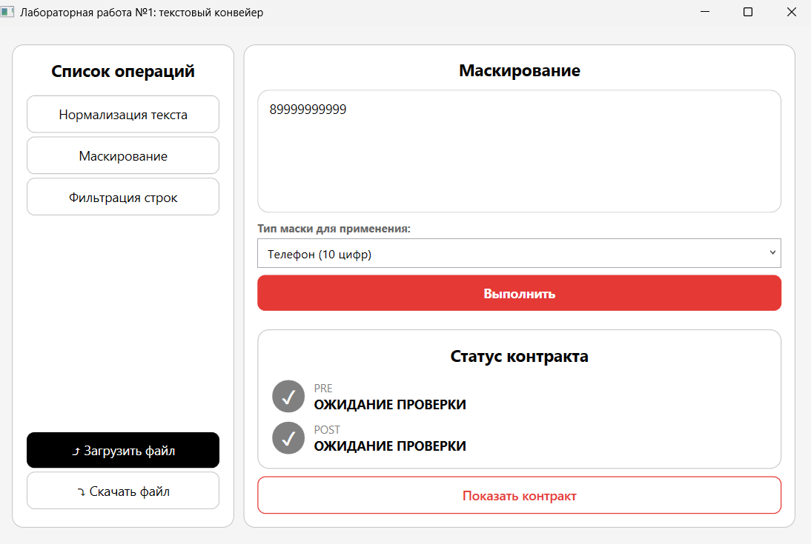
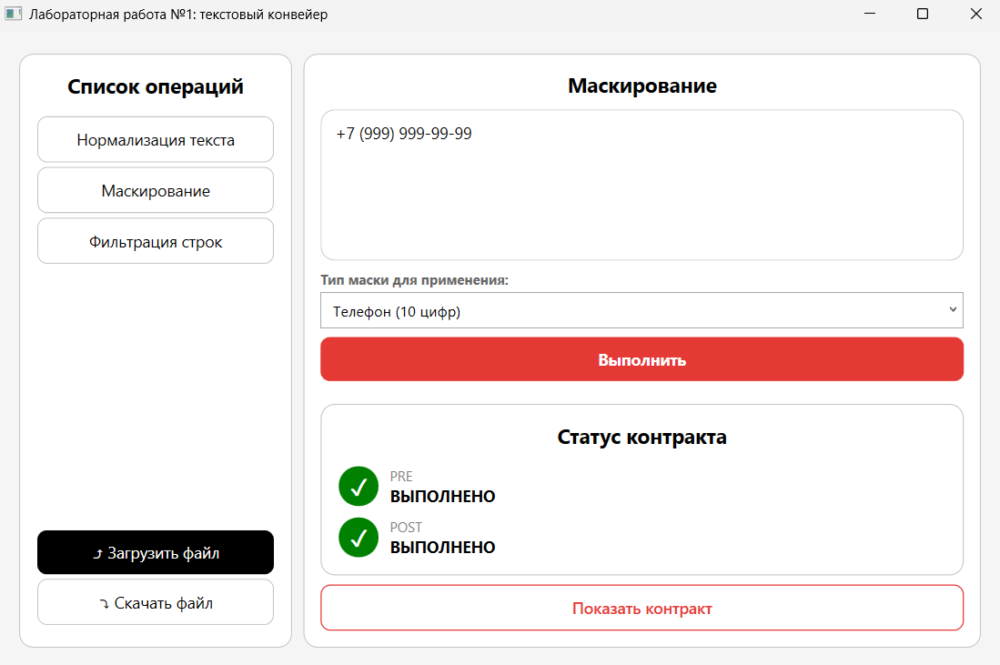

# TextProcessor (Обработчик текста)

Приложение «Обработчик текста» — программный комплекс для нормализации, маскирования и фильтрации текстовых данных, разработанный с использованием объектно-ориентированного программирования и архитектуры WPF (Windows Presentation Foundation). Цель приложения: предоставить надежный инструмент для преобразования строк с жестким контролем логики через контрактное программирование (проверка Pre- и Post-условий).

## Основные возможности

### Нормализация текста

* **Приведение регистра** — автоматический перевод всего текста в нижний регистр.
* **Очистка от спецсимволов** — удаление пунктуации, знаков препинания и замена переносов строк и табуляций на пробелы.
* **Форматирование пробелов** — замена двойных (и более) пробелов на одинарные, а также удаление пробелов в начале и конце строки.

### Маскирование данных

* **Российские номера телефонов** — преобразование строки в формат `+7 (XXX) XXX-XX-XX` с проверкой количества цифр.
* **СНИЛС** — форматирование ввода в стандартизированный вид `XXX-XXX-XXX XX`.
* **Банковские карты** — приведение 16-значных номеров к формату `XXXX XXXX XXXX XXXX`.

### Фильтрация

* **Поиск по ключевому слову** — фильтрация многострочного текста с оставлением только тех строк, которые содержат заданное слово.
* **Регистронезависимость** — поиск осуществляется без учета регистра символов.

### Система контрактов (ProcessResult)

* **Pre-условия** — проверка корректности входных данных до начала обработки (например, на пустоту или длину строки).
* **Post-условия** — валидация результатов выполнения (например, отсутствие символов шаблона в итоговой маске).
* **Статистика для UI** — сбор списков пройденных и проваленных условий с отображением успешности операции (`isSuccess`).

### Работа с файлами

* **Импорт** — загрузка текста из конкретного файла или пакетная загрузка `.txt` файлов из выбранной директории.
* **Экспорт** — сохранение обработанного текста (одной строкой или массивом строк) в указанный файл с автоматическим созданием директории при ее отсутствии.

### Интерфейс приложения

**Главное окно**

**Работа на примере маскирования**

## Как запустить

### Через Visual Studio

1. Откройте файл решения (Solution).
2. Убедитесь, что стартовым проектом установлен проект графического интерфейса на базе WPF.
3. Нажмите `Ctrl + F5` (`Ctrl + Fn + F5`) для запуска без отладки.
4. Откроется главное окно обработчика.

## Особенности программы

1. **Архитектура MVVM** — разделение логики и представления с использованием ViewModels (`MainViewModel`, `ContractViewModel`).
2. **Строгая валидация** — генерация исключений (`ArgumentNullException`, `InvalidOperationException`) при нарушении контрактов на уровне ядра нормализации.
3. **Модульное тестирование** — покрытие логики нормализации и фильтрации тестами с использованием фреймворка xUnit (`NormalizationTests`, `TextFilteringTests`).

## Требования

1. .NET 9.0 (для всех проектов решения).
2. Операционная система Windows 10/11 (на остальных системах работа **не гарантируется**).
